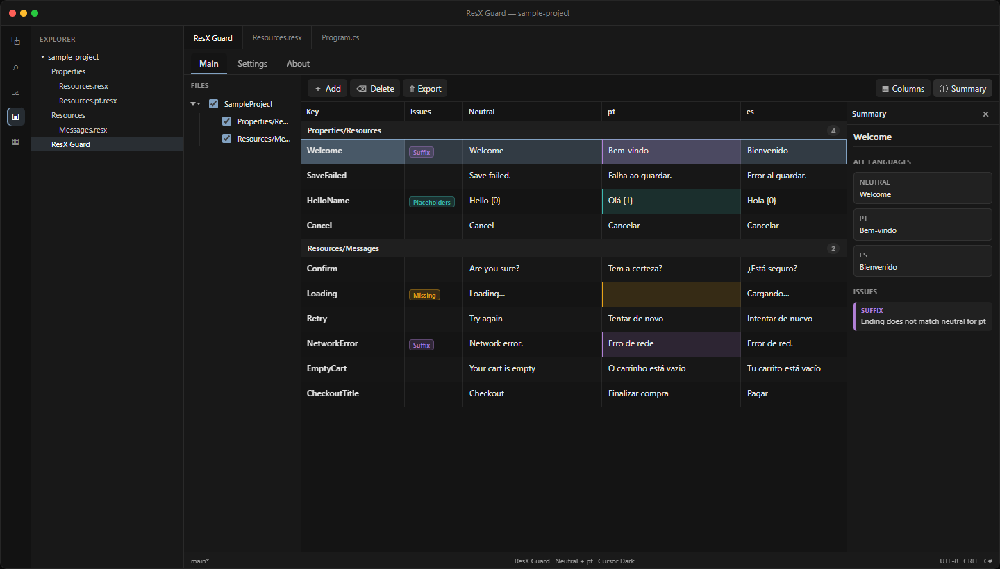
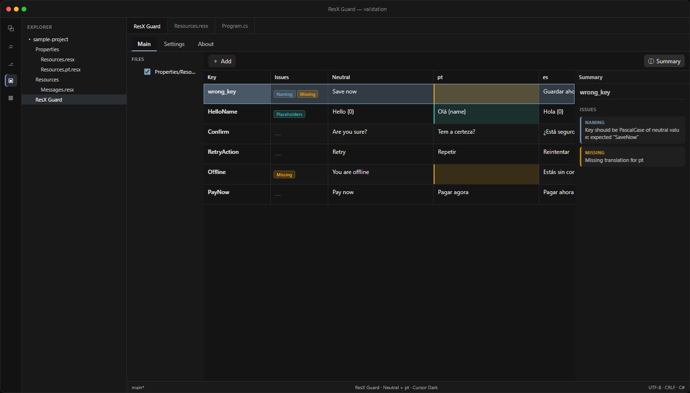
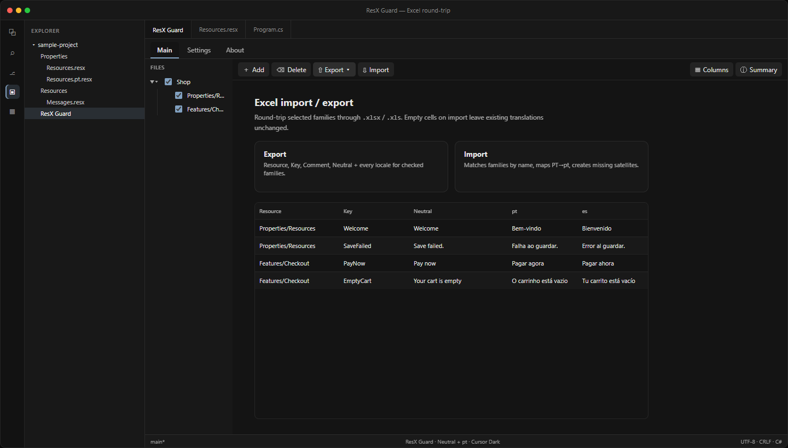

# ResX Guard

Fast, minimalist ResX translation manager for C# projects in Visual Studio Code.

[](https://marketplace.visualstudio.com/items?itemName=migueltavar3s.resx-guard)
[](https://marketplace.visualstudio.com/items?itemName=migueltavar3s.resx-guard)
[](LICENSE)

Inspired by Visual Studio ResX Resource Manager — spreadsheet-style grid, instant search, configurable validation, automatic `Resources.Designer.cs` updates, and Excel import/export.

**Install:** [Visual Studio Marketplace](https://marketplace.visualstudio.com/items?itemName=migueltavar3s.resx-guard) · ID `migueltavar3s.resx-guard`

## Screenshots

### Grid + Summary



### Validation chips and issues



### Excel import / export



## Features

- Spreadsheet-style grid: keys × languages
- File tree with checkboxes to scope which `.resx` families appear
- Choose which language columns to show; **Summary** always lists every locale
- Fast in-memory search/filter
- Validation rules (PascalCase keys, matching string endings, placeholders, missing translations)
- Warnings in the grid, Summary, and VS Code Problems panel
- Auto-update `*.Designer.cs` when keys change
- Import/export Excel (`.xlsx` / `.xls`) for the selected families
- Extension UI in **English** and **Portuguese**

## Usage

1. Open a workspace that contains `.resx` files
2. Run **ResX Guard: Open** from the command palette, or use the Activity Bar icon
3. Select resource families on the left, edit translations in the grid
4. Use **Export** / **Import** in the toolbar to round-trip the selected families through Excel (`.xlsx` / `.xls`). Empty cells on import leave existing translations unchanged.

## Settings

See **ResX Guard** in VS Code Settings for key naming, Designer.cs generation, and validation rules.

## Support

If ResX Guard saves you time, consider [sponsoring on GitHub](https://github.com/sponsors/migueltavar3s).

Issues: [github.com/migueltavar3s/resx-guard/issues](https://github.com/migueltavar3s/resx-guard/issues)

## Development

Work on **`dev`**. Merge to **`main`** when you want CI to run critical tests and publish to the Marketplace (`VSCE_PAT` secret required).

```bash
npm install
npm run build
npm test
```

Regenerate Marketplace screenshots (optional):

```bash
node scripts/capture-screenshots.mjs
```

### Test the UI (one step)

1. Open this repo in VS Code / Cursor
2. Press **F5** (or Run and Debug → **Run Extension (sample project)**)
3. A new Extension Development Host window opens with `fixtures/sample-project`
4. The ResX Guard panel should open automatically with Neutral + `pt` columns

In the left tree, check/uncheck `Resources` / `Messages` to filter. Click a row to see **Summary** with all languages.

Package a VSIX with `npm run package`.
