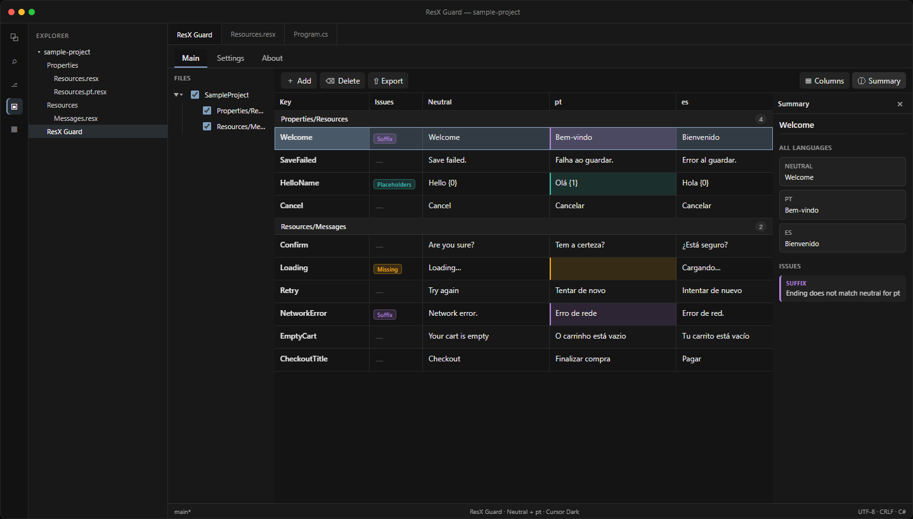
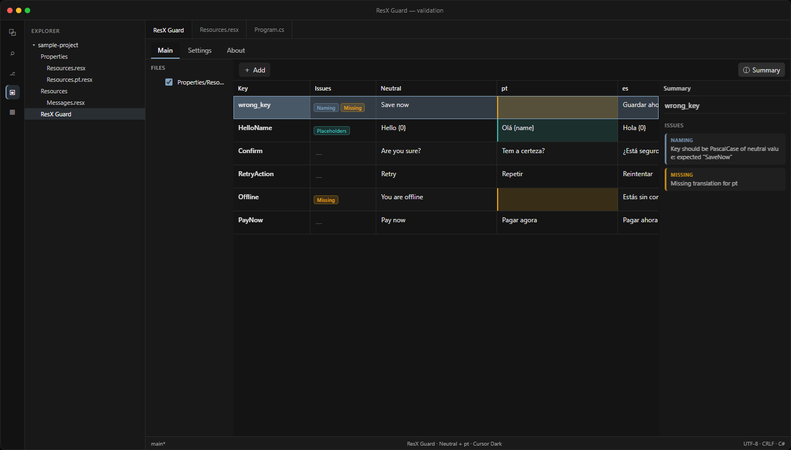
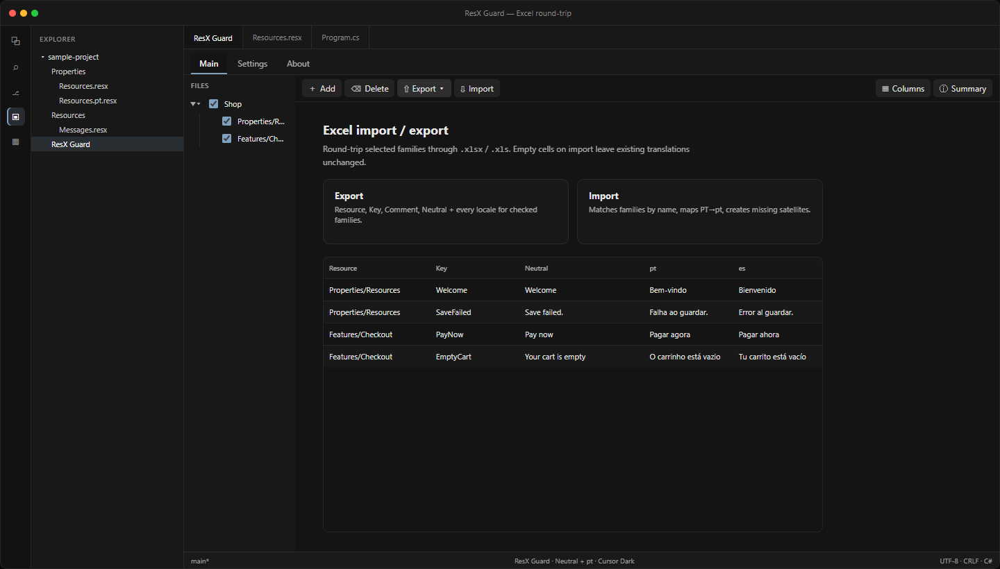

# ResX Guard

Spreadsheet-style translation manager for **.resx** and nested **JSON i18n** in **Visual Studio Code**, and for **.resx** in **Visual Studio 2022/2026**.

Inspired by Visual Studio ResX Resource Manager — one grid for keys × languages, search, validation, Excel import/export, and (for C# `.resx`) automatic `Resources.Designer.cs` updates.

**Install (VS Code):** [Visual Studio Marketplace](https://marketplace.visualstudio.com/items?itemName=migueltavar3s.resx-guard) · ID `migueltavar3s.resx-guard`

## Supported formats

| Format | Host | Layout |
|--------|------|--------|
| **`.resx`** | VS Code + Visual Studio | Classic satellites (`Resources.resx` + `Resources.pt.resx`) or folder cultures |
| **JSON / `.i18n`** | VS Code only | Nested files under a locale folder, e.g. `locales/en/translation.json` |

In VS Code, the Activity Bar **File Types** filter can show all, `.resx` only, or JSON only — useful when a workspace mixes C# resources and web i18n.

## Screenshots

### Grid + Summary

### Validation chips and issues

### Excel import / export

## Features

- Spreadsheet-style grid: keys × languages for every supported family
- File tree with checkboxes to scope which families appear
- Choose which language columns to show; **Summary** always lists every locale
- Fast in-memory search/filter with incremental file refresh
- Validation: naming from English, matching endings, placeholders, missing translations, duplicates
- Naming suggestions with **Apply** in the grid (`.resx` → PascalCase; JSON → camelCase leaf, nested path kept)
- Warnings in the grid, Summary, and Problems / Error List
- Auto-update `*.Designer.cs` when `.resx` keys change
- Import/export Excel (`.xlsx` / `.xls`) for the selected families
- UI in **English** and **Portuguese**

## JSON i18n details (VS Code)

- Files must sit directly in a locale-named folder (`locales/en/translation.json`, `locales/pt/translation.json`, …). Extensions `.json` and `.i18n` are accepted.
- The filename stem is the family (`translation`); nested objects become dot-keys in the grid (`navigation.dashboard`) and are written back as nested JSON.
- Config JSON (`package.json`, `tsconfig.json`, …) is ignored even under locale-like folders (`cs`, `ts`, …).
- Comments are not stored (standard JSON has none).
- Naming: keep the dotted path; the leaf should be camelCase of the English value. Placeholder and missing-translation checks still apply.

*Not every arbitrary i18n JSON layout is supported — only locale-folder nested catalogs like the ones above.*

## Usage

1. Open a workspace with `.resx` and/or `locales/<locale>/*.json` (VS Code), or a solution with `.resx` (Visual Studio)
2. **VS Code:** **ResX Guard: Open** from the command palette, or the Activity Bar icon — optional **File Types** filter
3. **Visual Studio:** **View → Other Windows → ResX Guard**
4. Select families on the left, edit in the grid
5. **Export** / **Import** for Excel round-trips; empty import cells leave existing values unchanged

## Settings

- **VS Code:** **ResX Guard** in Settings — key naming, Designer.cs (`.resx`), validation rules
- **Visual Studio:** **Tools → Options → ResX Guard**

## Support

If ResX Guard saves you time, consider [sponsoring on GitHub](https://github.com/sponsors/migueltavar3s).

Issues: [github.com/migueltavar3s/resx-guard/issues](https://github.com/migueltavar3s/resx-guard/issues)

See [CHANGELOG.md](CHANGELOG.md) for release notes.
